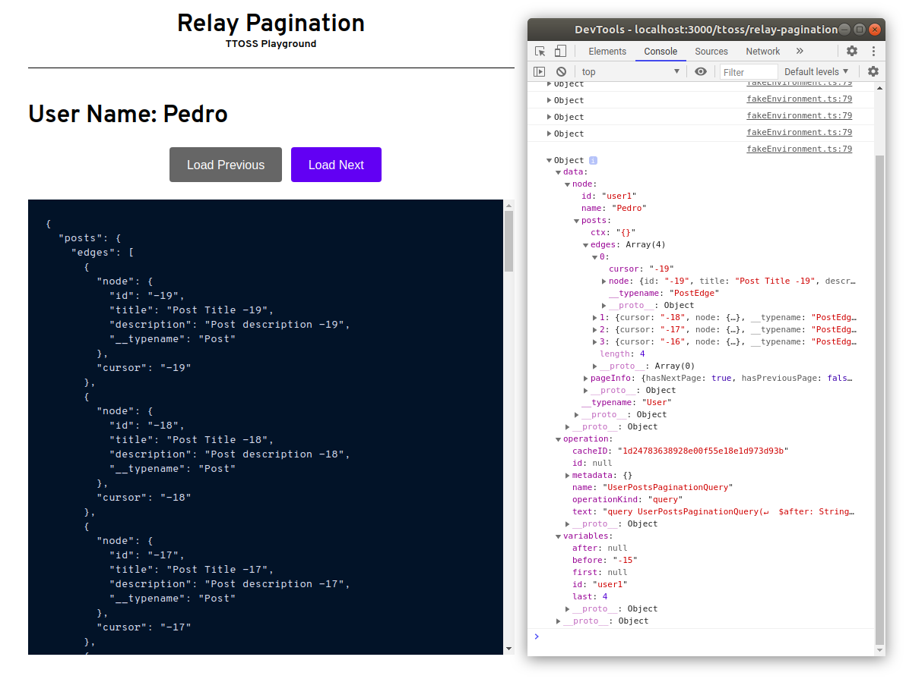

# Relay Pagination

This project was crated to help understanding better how cursor-based pagination works. I wrote a [tutorial](https://dev.to/ttoss/lett-s-go-build-pagination-with-relay-and-react-an-intermediary-tutorial-f89) showing the step by step I followed to create this project ;)

> "For me, writing this article helped me understand better how cursor-based pagination works because it is a concept that I studied while written this post. Also, it'll be a guide to use when I need to implement Relay pagination using hooks."
>
> "For you, I hope this article improved your acknowledgment of cursor-based pagination, Relay with hooks, and the concepts behind nodes, edges, and connetions."

Also, this project will be used as a client to another tutorial I'm writing about cursor-based pagination with AWS AppSync and DynamoDB.

## Technologies

- [TypeScript](https://www.typescriptlang.org/)
- [Relay with hooks](https://relay.dev/docs/en/experimental/a-guided-tour-of-relay)
- [React Concurrent Mode](https://reactjs.org/docs/concurrent-mode-intro.html)

## How to start

### Install

```
yarn
```

### Start

```
yarn start
```

### App Preview


